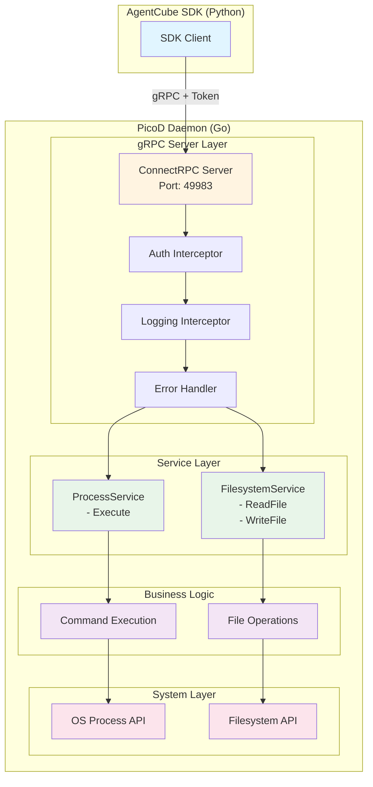
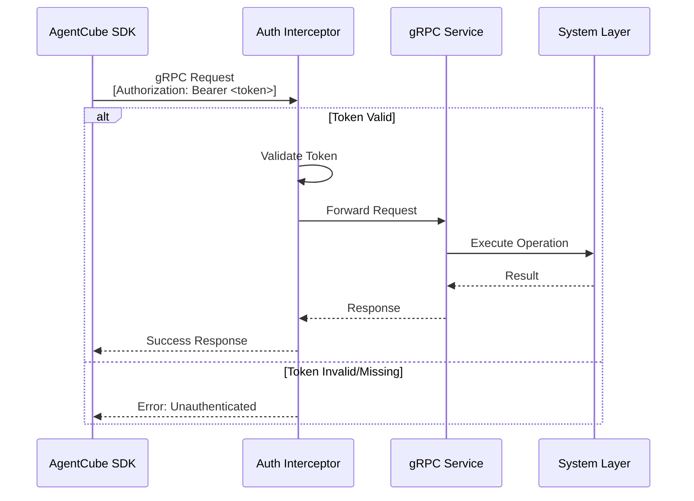

# PicoD Design Document

Author: VanderChen

## Motivation

The current AgentCube sandbox implementation relies on SSH (via `ssh_client.py`) for remote code execution, file transfer, and sandbox management. While SSH provides robust authentication and encryption, it introduces several challenges:

1. **Heavyweight Protocol**: SSH requires complex handshake procedures, key management, and session overhead
2. **Limited Customization**: SSH protocol constraints make it difficult to implement custom authentication schemes or optimize for specific use cases

To address these limitations, we propose **PicoD** (Pico Daemon) - a lightweight, HTTP-based service daemon that provides essential sandbox capabilities with minimal overhead while maintaining security through token-based authentication.

### Design Goals

PicoD is designed as a **stateless daemon** that processes individual gRPC requests independently:

- **Lightweight**: Minimal resource footprint suitable for containerized sandbox environments
- **Simple Protocol**: Pure gRPC/protobuf-based APIs that are easy to integrate and debug
- **Secure**: Token-based authentication without preset user requirements
- **No Lifecycle Management**: PicoD does not manage sandbox lifecycle (creation, deletion, monitoring). These responsibilities belong to the AgentCube control plane.
- **Single Request Processing**: Each gRPC call (Execute, ReadFile, WriteFile) is handled independently without maintaining state between requests.
- **No Session Management**: No persistent connections or session state. Each request is authenticated via token in metadata.
- **Ephemeral Process**: PicoD runs for the lifetime of the sandbox container but does not track or manage the sandbox's lifecycle events.

## Use Case

PicoD enables AI agents to interact with sandboxed environments through the AgentCube SDK. The following example demonstrates a complete workflow using multiple PicoD APIs:

### Machine Learning Workflow

An AI agent performs a complete machine learning workflow - uploading data, installing dependencies, training a model, and downloading results:

```python
from agentcube import Sandbox

# Create a sandbox instance
sandbox = Sandbox(ttl=3600, image="python:3.11-slim")

# Step 1: Upload dependencies file (WriteFile API)
sandbox.write_file(
    content="pandas\nnumpy\nscikit-learn\nmatplotlib",
    remote_path="/workspace/requirements.txt"
)

# Step 2: Install dependencies (Execute API)
sandbox.execute_command("pip install -r /workspace/requirements.txt")

# Step 3: Upload training data (WriteFile API)
sandbox.upload_file(
    local_path="./data/train.csv",
    remote_path="/workspace/train.csv"
)

# Step 4: Train model (Execute API)
training_code = """
import pandas as pd
from sklearn.linear_model import LinearRegression
import pickle

df = pd.read_csv('/workspace/train.csv')
X, y = df[['feature1', 'feature2']], df['target']

model = LinearRegression().fit(X, y)
pickle.dump(model, open('/workspace/model.pkl', 'wb'))
print(f'Model R² score: {model.score(X, y):.4f}')
"""
result = sandbox.run_code("python", training_code)
print(result)

# Step 5: Download trained model (ReadFile API)
sandbox.download_file(
    remote_path="/workspace/model.pkl",
    local_path="./models/model.pkl"
)

print("Workflow completed successfully!")
```

**API Calls Flow**:

1. **WriteFile (gRPC)**: Upload requirements.txt via client streaming
2. **Execute (gRPC)**: Install dependencies via pip command
3. **WriteFile (gRPC)**: Upload training data CSV file via client streaming
4. **Execute (gRPC)**: Run Python training code that processes data and trains model
5. **ReadFile (gRPC)**: Download trained model via server streaming

All operations use the same gRPC connection with token authentication in metadata.

## Reference Implementation: envd

PicoD's design is heavily inspired by **envd** (Environment Daemon) from E2B, which successfully demonstrates a lightweight daemon approach for sandbox management. Key learnings from envd:

### Architecture Patterns

- **Pure gRPC**: All operations use gRPC/protobuf for consistency and performance
- **Connect Protocol**: Uses ConnectRPC for efficient bidirectional streaming
- **Modular Services**: Separate service layers for filesystem, process management, and system operations
- **Token Authentication**: Simple token-based auth in gRPC metadata

### Core Services (simplified from envd)
1. **Filesystem Service** (read file, write file)
2. **Process Service** (execute command)

## PicoD Architecture

### High-Level Design

#### System Architecture



#### Authentication Flow



### Component Breakdown

#### 1. gRPC Server Layer (Go Implementation)
- **Framework**: ConnectRPC (efficient, HTTP/2-based gRPC)
- **Port**: Configurable (default: 49983, matching envd)
- **Interceptor Stack**:
  - Token authentication interceptor
  - Request ID generation and logging
  - Error handling and recovery
  - Metrics collection

#### 2. gRPC Services (Protobuf Definitions)

**FilesystemService**
- `ReadFile(path) → stream bytes`: Download file content (replaces `download_file()`)
- `WriteFile(path, stream bytes) → void`: Upload file content (replaces `write_file()` and `upload_file()`)

**ProcessService**
- `Execute(cmd, timeout) → ExecuteResponse`: Execute command and return output (replaces `execute_command()`)

#### 3. Authentication & Authorization

**Token-Based Authentication**

PicoD is a **stateless daemon** that handles individual gRPC requests without managing sandbox lifecycle. It uses a simple token-based authentication mechanism where the access token is passed in gRPC metadata and validated by an interceptor for each request.

**Token Source Options for Sandbox Environments**

When PicoD runs inside a sandbox container, the access token must be securely provided at startup. Several options are available depending on the deployment environment:

##### Option 1: Kubernetes Secret Mount (Recommended for K8s)
Mount the token as a file via Kubernetes Secret:

```yaml
apiVersion: v1
kind: Pod
metadata:
  name: sandbox-pod
spec:
  containers:
  - name: picod
    image: picod:latest
    env:
    - name: PICOD_ACCESS_TOKEN_FILE
      value: /var/run/secrets/picod/token
    volumeMounts:
    - name: picod-token
      mountPath: /var/run/secrets/picod
      readOnly: true
  volumes:
  - name: picod-token
    secret:
      secretName: picod-access-token
```

**Advantages**:
- Native Kubernetes integration
- Automatic secret rotation support
- Secure storage in etcd
- RBAC-controlled access

**Implementation**: PicoD reads token from file specified by `PICOD_ACCESS_TOKEN_FILE` environment variable.

##### Option 2: Cloud-Init Injection
Inject token via cloud-init user-data for VM-based sandboxes:

```yaml
#cloud-config
write_files:
  - path: /etc/picod/token
    permissions: '0600'
    owner: root:root
    content: |
      ${PICOD_ACCESS_TOKEN}

runcmd:
  - export PICOD_ACCESS_TOKEN=$(cat /etc/picod/token)
  - /usr/local/bin/picod --port 49983
```

**Advantages**:
- Works with VM-based sandboxes (Firecracker, QEMU)
- Token available before any services start
- No external dependencies

**Use Case**: Suitable for microVM environments where Kubernetes is not available.

##### Option 3: Environment Variable (Simple Deployment)
Pass token directly as environment variable:

```bash
docker run -e PICOD_ACCESS_TOKEN=<token> picod:latest
```

**Advantages**:
- Simplest configuration
- Works with any container runtime
- No file system dependencies

**Disadvantages**:
- Token visible in process list
- Less secure for production environments

**Use Case**: Development, testing, or trusted environments.

##### Option 4: Instance Metadata Service (Cloud Provider)
Fetch token from cloud provider metadata service:

```go
// PicoD startup code
token, err := fetchTokenFromMetadata("http://169.254.169.254/latest/meta-data/picod-token")
```

**Advantages**:
- No secrets in container image or config
- Cloud-native approach
- Automatic credential management

**Use Case**: Cloud-hosted sandbox environments with instance metadata support.

**Token Configuration Priority**

PicoD checks token sources in the following order:
1. `--access-token` command-line flag (highest priority)
2. `PICOD_ACCESS_TOKEN` environment variable
3. `PICOD_ACCESS_TOKEN_FILE` environment variable (reads from file)
4. `/etc/picod/token` default file location
5. Instance metadata service (if configured)

**Token Validation**

All gRPC requests must include the token in metadata:
```
Authorization: Bearer <access_token>
```

The auth interceptor validates the token on every request. Since PicoD is stateless, there is no session management or token caching beyond the initial startup configuration.

#### 4. Core Capabilities

##### Code Execution
Replaces SSH's `exec_command()`:

```protobuf
// Simple unary RPC for command execution
rpc Execute(ExecuteRequest) returns (ExecuteResponse);

message ExecuteRequest {
    string command = 1;          // Full command string to execute
    optional float timeout = 2;  // Execution timeout in seconds (default: 30)
}

message ExecuteResponse {
    string stdout = 1;           // Command stdout
    string stderr = 2;           // Command stderr
    int32 exit_code = 3;         // Exit code
}
```

##### File Transfer

**Upload** (replaces `write_file()` and `upload_file()`):
```protobuf
// Client-streaming RPC for file upload
rpc WriteFile(stream WriteFileRequest) returns (WriteFileResponse);

message WriteFileRequest {
    oneof request {
        WriteFileMetadata metadata = 1;
        bytes chunk = 2;
    }
}

message WriteFileMetadata {
    string path = 1;
    optional uint32 mode = 2;  // File permissions (e.g., 0644)
}

message WriteFileResponse {
    EntryInfo entry = 1;
}
```

**Download** (replaces `download_file()`):
```protobuf
// Server-streaming RPC for file download
rpc ReadFile(ReadFileRequest) returns (stream ReadFileResponse);

message ReadFileRequest {
    string path = 1;
}

message ReadFileResponse {
    oneof response {
        ReadFileMetadata metadata = 1;
        bytes chunk = 2;
    }
}

message ReadFileMetadata {
    EntryInfo entry = 1;
}
```


## Python SDK Interface

### PicoDClient Class

The Python SDK provides a simple interface for interacting with PicoD:

```python
class PicoDClient:
    """Client for interacting with PicoD daemon via gRPC"""
    
    def __init__(self, host: str, port: int = 49983, access_token: str):
        """Initialize PicoD client with connection parameters"""
        
    def execute_command(self, command: str, timeout: float = 30) -> str:
        """Execute a command and return stdout"""
        
    def execute_commands(self, commands: List[str]) -> Dict[str, str]:
        """Execute multiple commands"""
        
    def run_code(self, language: str, code: str, timeout: float = 30) -> str:
        """Run code snippet in specified language"""
        
    def write_file(self, content: str, remote_path: str, mode: Optional[int] = None) -> None:
        """Write content to remote file"""
        
    def upload_file(self, local_path: str, remote_path: str, mode: Optional[int] = None) -> None:
        """Upload local file to remote server"""
        
    def download_file(self, remote_path: str, local_path: str) -> None:
        """Download remote file to local path"""
```

## Security Considerations

1. **Token Management**:
   - Access tokens generated per sandbox instance by AgentCube API server
   - Tokens stored securely in memory only within PicoD
   - Token provided at PicoD startup via one of the configured sources
   - No token rotation needed (PicoD lifecycle matches sandbox lifecycle)

2. **File Access Control**:
   - Path sanitization to prevent directory traversal attacks
   - User-based permission checks enforced by OS
   - No arbitrary file system access outside sandbox boundaries

3. **Process Isolation**:
   - Processes run with sandbox user privileges
   - Resource limits enforced via container runtime (cgroups)
   - No privilege escalation mechanisms

4. **Network Security**:
   - PicoD listens on all interfaces (0.0.0.0) within sandbox network namespace
   - Network isolation provided by container/pod networking
   - Token authentication required for all operations
   - Optional TLS support for production deployments


## Future Enhancements

1. **WebSocket Support**: Real-time bidirectional communication for interactive shells
2. **Compression**: Gzip compression for file transfers
3. **Multiplexing**: Multiple operations over single connection
4. **Metrics Export**: Prometheus-compatible metrics endpoint
5. **Plugin System**: Custom handlers for domain-specific operations
6. **TLS/mTLS**: Encrypted communication for production environments

## Conclusion

PicoD provides a lightweight, efficient alternative to SSH for sandbox management in AgentCube. By leveraging modern HTTP/gRPC protocols and token-based authentication, it reduces resource overhead while maintaining security and functionality. The design ensures easy integration with existing AgentCube infrastructure and provides a clear migration path from the current SSH-based implementation.
