# agent-run子系统设计文档

## 1. 概述

agent-run子系统提供安全隔离的沙箱环境，用于运行AI生成的代码和代理。系统通过会话管理直接调用外部沙箱服务，实现用户请求的安全转发和执行环境的动态管理。SessionManager 集成了 Sandbox Provider SDK，负责完整的会话和沙箱生命周期管理。

## 2. 架构视图

### 2.1 逻辑视图（Logical View）

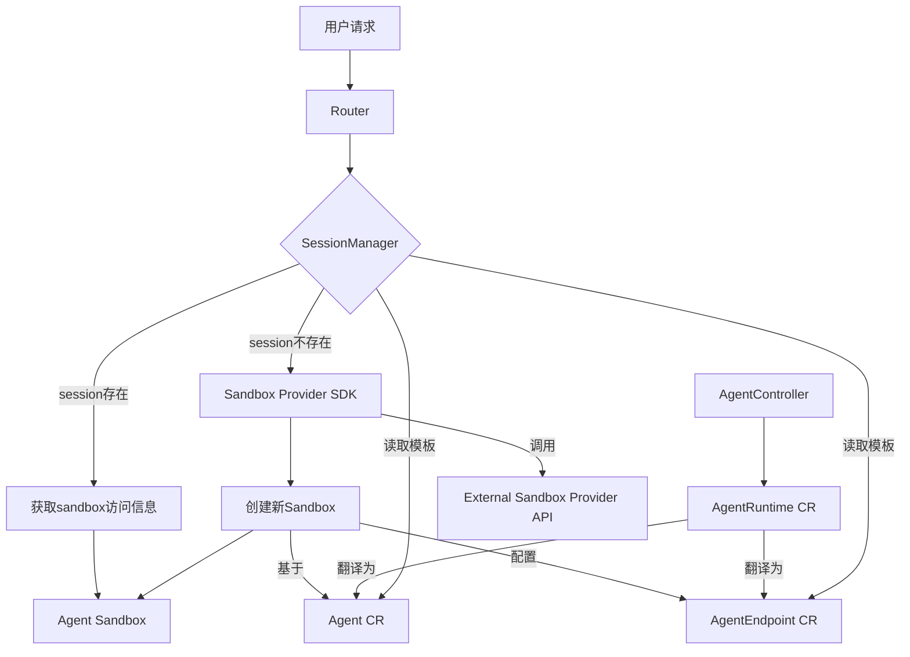

### 2.2 开发视图（Development View）

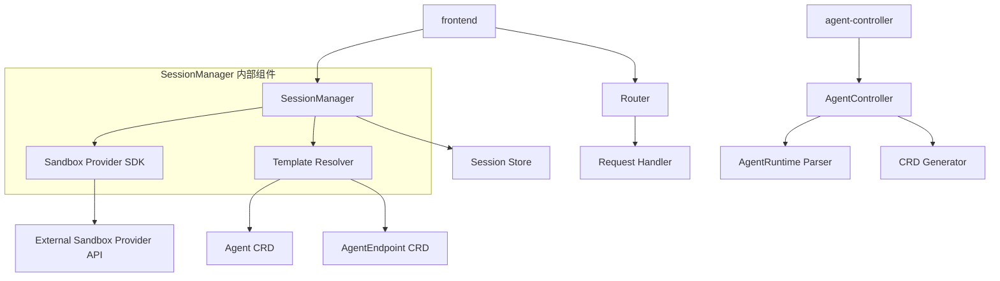

### 2.3 进程视图（Process View）

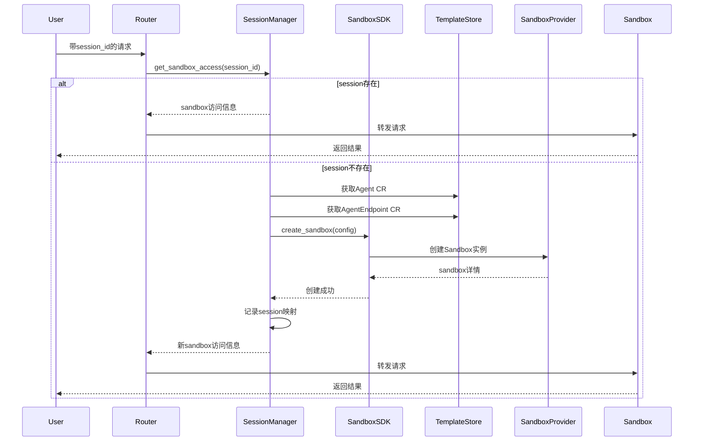

### 2.4 物理视图（Physical View）

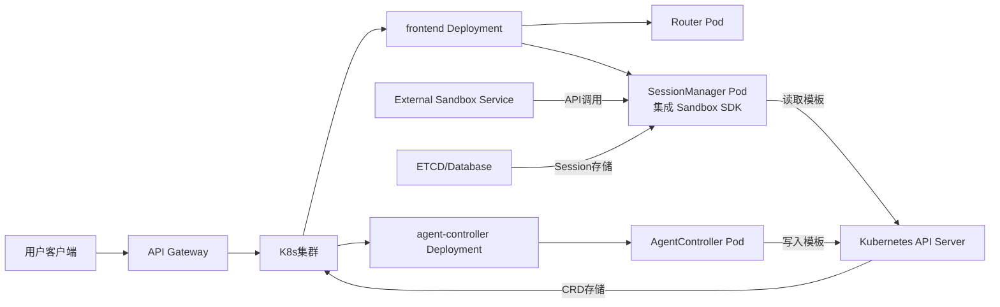

### 2.5 组件视图（Component View）

组件视图展示了 agent-run 子系统的主要组件及其接口关系，体现了系统的模块化设计和清晰的职责划分。

#### 2.5.1 系统组件架构

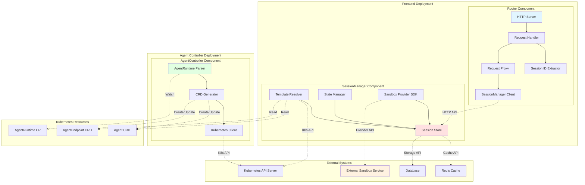

#### 2.5.2 组件接口定义

##### 2.5.2.1 Router 组件接口

**对外提供的接口**：
- `HTTP API`：接收用户请求，支持多种 session-id 提取方式
- `Health Check API`：提供健康检查端点
- `Metrics API`：暴露 Prometheus 格式的监控指标

**依赖的接口**：
- `SessionManager API`：获取 sandbox 访问信息
- `Sandbox HTTP API`：转发请求到目标 sandbox

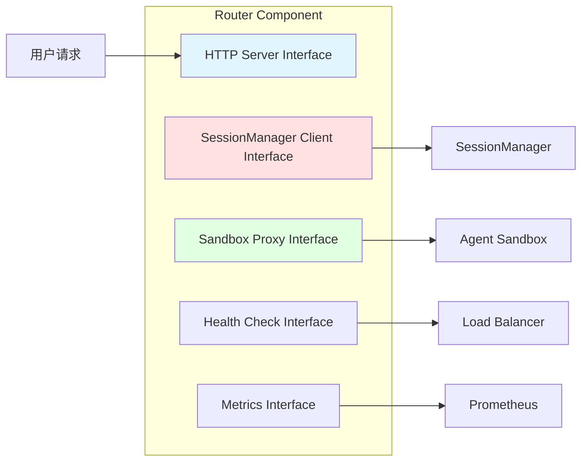

##### 2.5.2.2 SessionManager 组件接口

**对外提供的接口**：
- `Session Management API`：会话生命周期管理
- `Sandbox Endpoint API`：提供 sandbox 访问信息
- `Session Control API`：支持 pause/resume 操作

**依赖的接口**：
- `Kubernetes API`：读取 CRD 模板
- `Sandbox Provider API`：管理外部 sandbox 实例
- `Cache API`：会话数据缓存
- `Storage API`：持久化存储

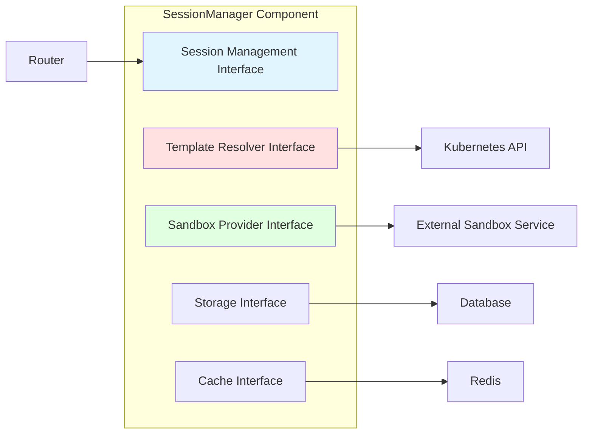

##### 2.5.2.3 AgentController 组件接口

**对外提供的接口**：
- `CRD Management API`：管理 Agent 和 AgentEndpoint CRD

**依赖的接口**：
- `Kubernetes API`：创建和更新 CRD 资源
- `AgentRuntime Watch API`：监听 AgentRuntime 变更

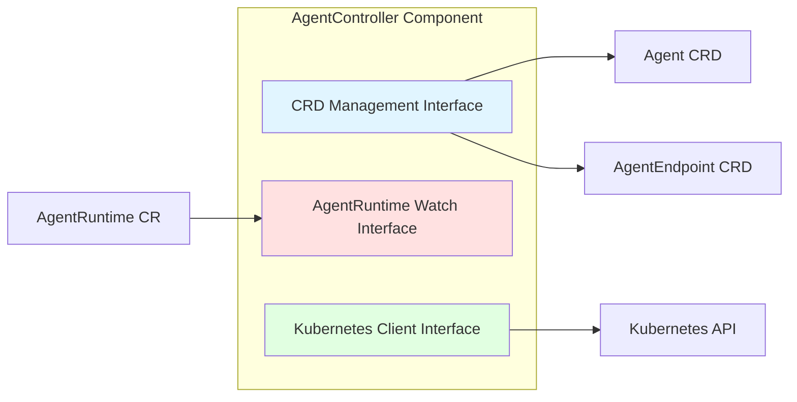

#### 2.5.3 组件交互模式

##### 2.5.3.1 同步交互

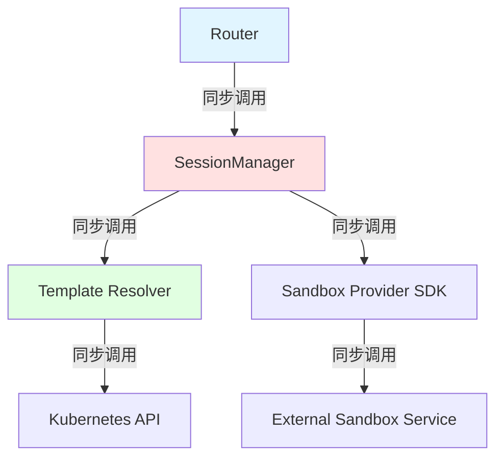

**特点**：
- Router 与 SessionManager 之间采用同步 HTTP 调用
- SessionManager 内部组件间采用同步接口调用
- 适用于实时性要求高的操作

##### 2.5.3.2 异步交互

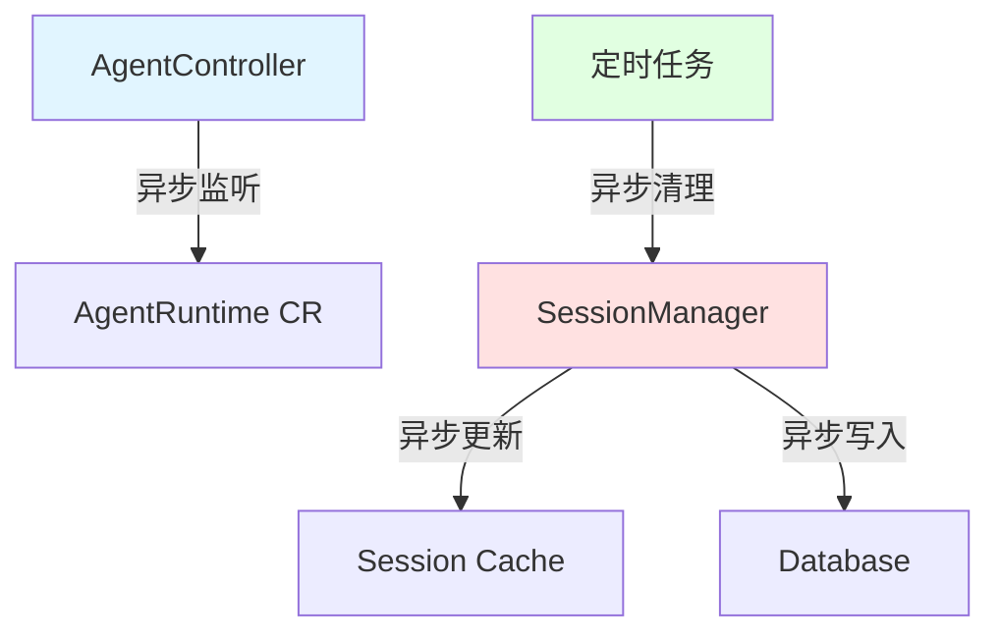

**特点**：
- AgentController 异步监听 AgentRuntime 变更
- SessionManager 异步更新缓存和持久化存储
- 定时任务异步执行会话清理

#### 2.5.4 组件部署视图

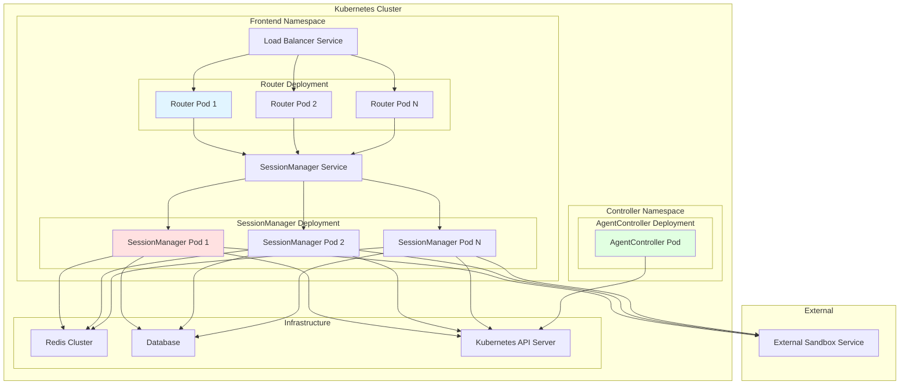

### 2.6 场景视图（Scenarios）

**场景1：新用户会话创建**

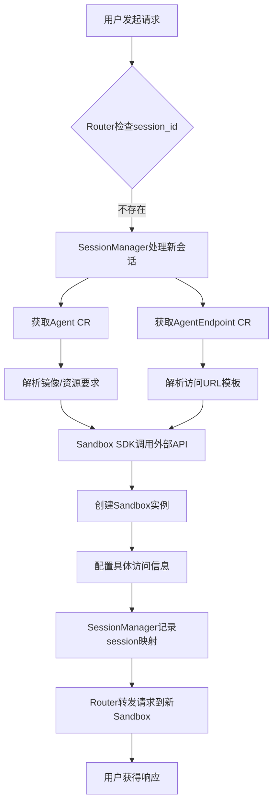

## 3. 关键设计决策

### 3.1 模板与实例分离

- **Agent CRD**：定义agent的模板信息（镜像、资源配额、环境变量等）
- **AgentEndpoint CRD**：定义访问该类agent的URL模板和认证策略
- **SessionManager**：集成 Sandbox Provider SDK，负责将模板实例化为具体的sandbox实例，并配置具体的访问信息

### 3.2 职责清晰划分

- **agent-controller**：仅负责CRD模板的翻译和生成，不涉及具体实例管理
- **SessionManager**：承担会话管理、模板解析、实例创建和具体配置的完整职责
- **Sandbox Provider SDK**：作为 SessionManager 的组成部分，提供与外部沙箱服务交互的抽象接口

### 3.3 SDK 集成设计

- SessionManager 内置 Sandbox Provider SDK，无需独立的 InstanceManager 组件
- SDK 提供统一的沙箱生命周期管理接口（创建、暂停、恢复、删除）
- 模板解析器（Template Resolver）作为 SessionManager 内部组件，负责将CRD模板转换为具体配置
- 支持多种外部沙箱服务提供商的插件化架构

## 4. 子模块设计

### 4.1 SessionManager 模块

#### 4.1.1 模块概述

SessionManager 是 agent-run 子系统 frontend 组件的核心模块，负责管理用户会话的完整生命周期。该模块集成了 Sandbox Provider SDK，维护 session 与 sandbox 之间的 1:1 映射关系，提供会话状态管理、沙箱实例管理、访问控制和资源回收功能。SessionManager 采用被动创建机制，当用户请求携带新的 session ID 时自动创建会话，无需显式创建接口。

#### 4.1.2 核心职责

- 维护 session 与 sandbox 的映射关系
- 管理会话生命周期状态转换
- 集成 Sandbox Provider SDK，直接管理沙箱实例
- 解析 Agent CRD 和 AgentEndpoint CRD 模板
- 提供 sandbox 访问端点查询接口
- 处理用户发起的 pause/resume 操作
- 自动清理过期和空闲会话
- 确保会话所有权和访问控制

#### 4.1.3 与整体架构关系

SessionManager 作为 frontend 组件的核心部分，直接与外部沙箱服务交互：

- **Router**：消费 SessionManager 提供的 sandbox 访问信息，负责请求路由
- **Sandbox Provider SDK**：作为 SessionManager 的内部组件，提供沙箱生命周期管理
- **External Sandbox Service**：通过集成的 SDK 直接交互
- **Kubernetes API Server**：读取 Agent CRD 和 AgentEndpoint CRD 模板

#### 4.1.4 内部组件架构

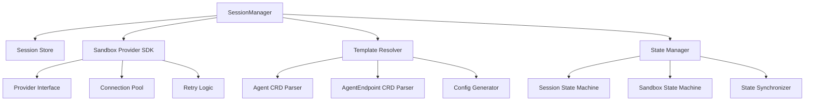

#### 4.1.5 核心数据结构

##### 4.1.5.1 Session 对象

```
Session {
  id: string                // 唯一会话ID，由客户端生成
  state: SessionState       // 会话状态
  create_time: timestamp    // 会话创建时间
  last_access: timestamp    // 最后访问时间
  ttl: integer              // 生存时间(秒)，0表示永不过期
  user_id: string           // 会话所有者ID
  agent_type: string        // agent类型标识
  sandbox: Sandbox          // 关联的sandbox对象
  config: SandboxConfig     // 沙箱配置信息
}
```

##### 4.1.5.2 Sandbox 对象

```
Sandbox {
  id: string                // sandbox唯一ID，由外部服务生成
  state: SandboxState       // sandbox主状态
  runtime_state: RuntimeState // 运行时子状态
  endpoint: string          // 访问端点URL
  create_time: timestamp    // 创建时间
  last_heartbeat: timestamp // 最后心跳时间
  provider_metadata: map   // 外部服务提供商特定的元数据
}
```

##### 4.1.5.3 SandboxConfig 对象

```
SandboxConfig {
  image: string             // 容器镜像
  resources: ResourceSpec   // 资源配额
  environment: map          // 环境变量
  volumes: []VolumeSpec     // 存储卷配置
  network: NetworkSpec      // 网络配置
  security: SecuritySpec    // 安全策略
  endpoint_template: string // 访问端点模板
  auth_config: AuthConfig   // 认证配置
}
```

##### 4.1.5.4 状态枚举

**SessionState:**

- `active`: 会话活跃，可接受请求
- `idle`: 会话空闲，sandbox已暂停
- `paused`: 用户主动暂停
- `terminated`: 会话已终止，资源已释放

**SandboxState:**

- `pending`: 创建请求已接收，正在处理
- `scheduled`: 资源已分配，准备启动
- `running`: 正常运行中
- `paused`: 已暂停，保留状态
- `deleted`: 资源已释放
- `failed`: 创建或运行失败

**RuntimeState (仅当 SandboxState=running 时有效):**

- `busy`: 正在处理请求
- `idle`: 空闲等待请求

#### 4.1.6 Sandbox Provider SDK 设计

##### 4.1.6.1 SDK 接口定义

```
interface SandboxProviderSDK {
  // 沙箱生命周期管理
  CreateSandbox(
    context: Context,
    config: SandboxConfig
  ): (sandbox_id: string, endpoint: string, error)
  
  GetSandboxStatus(
    context: Context,
    sandbox_id: string
  ): (state: SandboxState, metadata: map, error)
  
  PauseSandbox(
    context: Context,
    sandbox_id: string
  ): error
  
  ResumeSandbox(
    context: Context,
    sandbox_id: string
  ): error
  
  DeleteSandbox(
    context: Context,
    sandbox_id: string
  ): error
  
  // 批量操作
  ListSandboxes(
    context: Context,
    filters: map
  ): ([]SandboxInfo, error)
  
  // 健康检查
  HealthCheck(context: Context): error
}
```

##### 4.1.6.2 Provider 插件架构

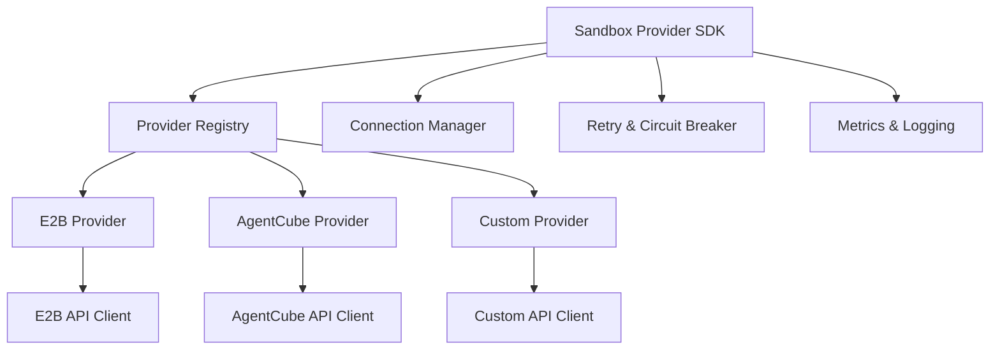

##### 4.1.6.3 配置管理

```
ProviderConfig {
  provider_type: string     // 提供商类型 (e2b, agentcube, custom)
  api_endpoint: string      // API 端点
  auth_config: AuthConfig   // 认证配置
  timeout: duration         // 请求超时
  retry_config: RetryConfig // 重试配置
  rate_limit: RateLimit     // 速率限制
}
```

#### 4.1.7 状态机设计

##### 4.1.7.1 Session 状态转换

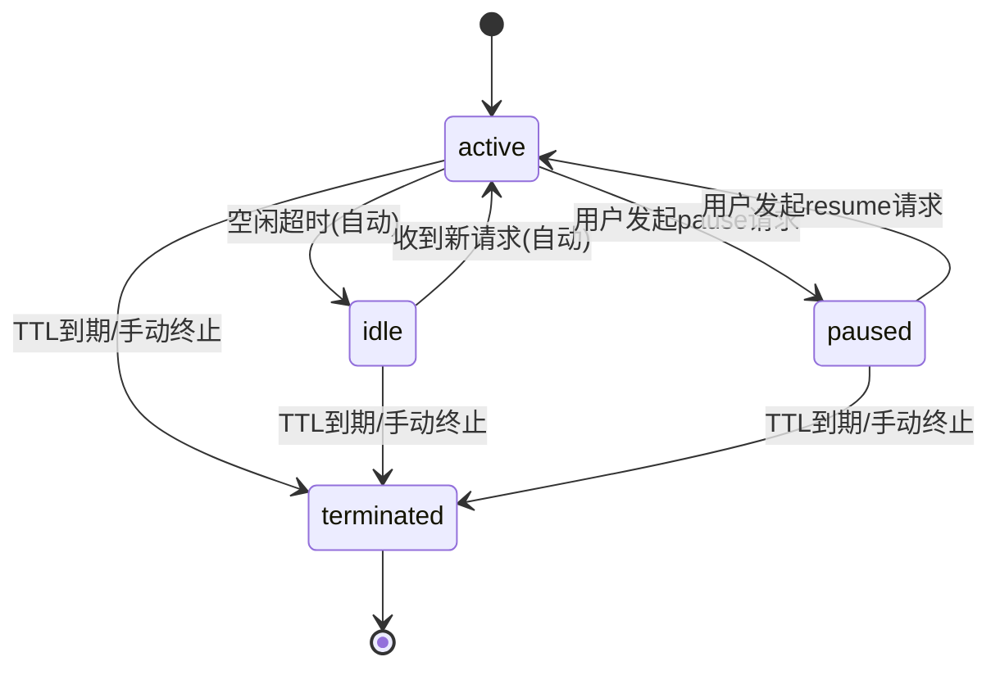

##### 4.1.7.2 Sandbox 状态转换

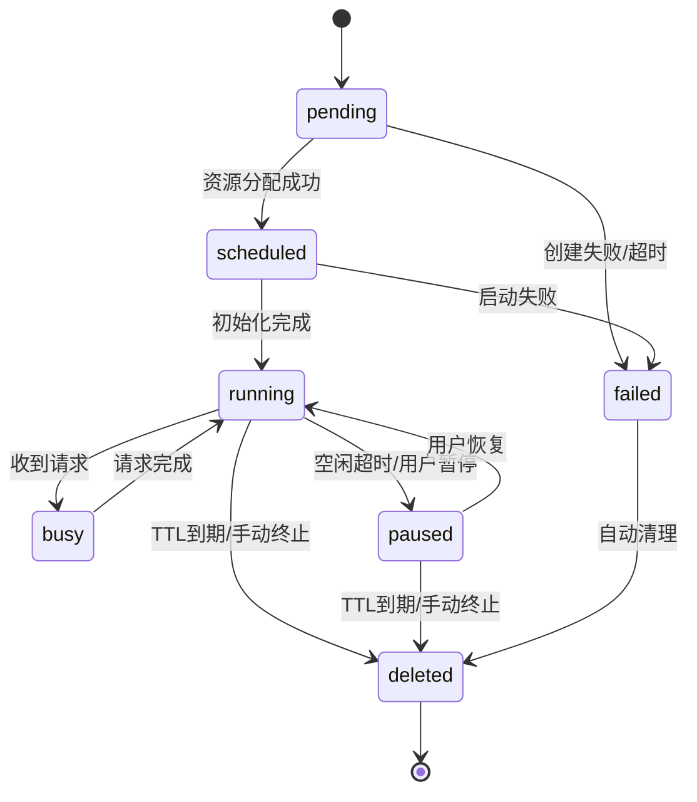

#### 4.1.8 接口设计

##### 4.1.8.1 核心接口

```
interface SessionManager {
  // 获取或创建会话，核心入口
  GetOrCreateSession(
    context: Context,
    session_id: string,
    agent_type: string,
    user_id: string,
    ttl: integer
  ): Session
  
  // 获取sandbox访问端点
  GetSandboxEndpoint(
    context: Context,
    session_id: string,
    request_type: RequestType
  ): string
  
  // 用户控制接口
  PauseSession(
    context: Context,
    session_id: string,
    user_id: string
  ): boolean
  
  ResumeSession(
    context: Context,
    session_id: string,
    user_id: string
  ): boolean
  
  // 内部管理接口
  CleanupExpiredSessions(context: Context): integer
  UpdateSessionHeartbeat(context: Context, session_id: string): boolean
  GetSessionState(context: Context, session_id: string): SessionState
  
  // 新增：直接沙箱管理接口
  GetSandboxStatus(
    context: Context,
    session_id: string
  ): (SandboxState, map, error)
}
```

##### 4.1.8.2 Template Resolver 接口

```
interface TemplateResolver {
  // 解析 Agent CRD 模板
  ResolveAgentTemplate(
    context: Context,
    agent_type: string
  ): (SandboxConfig, error)
  
  // 解析 AgentEndpoint CRD 模板
  ResolveEndpointTemplate(
    context: Context,
    agent_type: string,
    sandbox_id: string
  ): (endpoint: string, auth_config: AuthConfig, error)
  
  // 验证模板有效性
  ValidateTemplate(
    context: Context,
    agent_type: string
  ): error
}
```

#### 4.1.9 核心流程

##### 4.1.9.1 会话获取/创建流程

1. Router 收到用户请求，提取 session_id 和 user_id
2. 调用 SessionManager.GetOrCreateSession
3. SessionManager 检查 session_id 是否存在
   - **存在**：验证 user_id 权限，更新最后访问时间
   - **不存在**：创建新会话和沙箱
4. 对于新会话：
   - 根据 agent_type 从 Kubernetes 获取 Agent CRD 和 AgentEndpoint CRD 模板
   - Template Resolver 解析模板生成 SandboxConfig
   - 调用 Sandbox Provider SDK 创建沙箱实例
   - 等待沙箱状态变为 running
   - 记录 session 与 sandbox 映射关系
5. 返回 session 信息给 Router
6. Router 获取 sandbox endpoint 并转发请求

##### 4.1.9.2 空闲超时处理流程

1. 定时任务扫描所有 active 状态的 session
2. 检查最后访问时间是否超过空闲阈值
3. 对于超时空闲的 session：
   - 验证 sandbox 状态为 running/idle
   - 调用 Sandbox Provider SDK.PauseSandbox
   - 更新 session 状态为 idle
   - 更新 sandbox 状态为 paused
4. 记录状态变更事件

##### 4.1.9.3 用户控制流程

1. 用户发起 pause/resume 请求
2. Router 验证请求格式和权限
3. 调用 SessionManager.PauseSession/ResumeSession
4. SessionManager 验证：
   - session 存在且未终止
   - user_id 与 session 所有者匹配
   - 状态转换合法
5. 调用 Sandbox Provider SDK 执行沙箱状态变更
6. 同步更新 session 和 sandbox 状态
7. 返回操作结果

##### 4.1.9.4 模板解析流程

1. Template Resolver 从 Kubernetes API Server 获取 Agent CRD
2. 解析 CRD 中的镜像、资源、环境变量等配置
3. 从 AgentEndpoint CRD 获取访问端点模板和认证配置
4. 生成完整的 SandboxConfig 对象
5. 验证配置的有效性和完整性
6. 返回配置给 SessionManager

#### 4.1.10 与其他组件交互

##### 4.1.10.1 与 Router 交互

- **输入**：用户请求中的 session_id, user_id, agent_type
- **输出**：sandbox endpoint, session 状态
- **调用方向**：Router → SessionManager
- **接口**：GetOrCreateSession, GetSandboxEndpoint, PauseSession, ResumeSession

##### 4.1.10.2 与 External Sandbox Service 交互

- **输入**：SandboxConfig, 控制命令
- **输出**：sandbox 详情, 状态变更结果
- **调用方向**：SessionManager → External Sandbox Service (通过 SDK)
- **接口**：CreateSandbox, PauseSandbox, ResumeSandbox, DeleteSandbox, GetSandboxStatus

##### 4.1.10.3 与 Kubernetes API Server 交互

- **输入**：agent_type
- **输出**：Agent CRD, AgentEndpoint CRD 模板
- **调用方向**：SessionManager → Kubernetes API Server
- **接口**：Get Agent CRD, Get AgentEndpoint CRD

#### 4.1.11 关键设计决策

##### 4.1.11.1 SDK 集成架构

- 将 Sandbox Provider SDK 作为 SessionManager 的内部组件，简化架构
- 支持多种外部沙箱服务提供商的插件化设计
- 提供统一的沙箱管理接口，屏蔽不同提供商的差异

##### 4.1.11.2 被动创建机制

- 会话在用户首次请求时自动创建，无需预分配
- 降低系统复杂度，简化用户使用流程
- 支持动态 agent_type 选择，提升灵活性

##### 4.1.11.3 状态同步策略

- **强一致性**：用户操作时同步更新 session 和 sandbox 状态
- **最终一致性**：自动状态变更（如空闲超时）采用异步更新
- **状态恢复**：定期校验 session 和 sandbox 状态一致性，自动修复

##### 4.1.11.4 存储架构

- **多级缓存**：内存缓存 + 分布式缓存 (Redis) + 持久化存储
- **缓存策略**：
  - 热点 session：内存缓存 (LRU, TTL=5分钟)
  - 所有 session：Redis 缓存 (TTL=会话TTL+缓冲)
  - 持久化：异步写入数据库
- **读写分离**：读操作优先从缓存获取，写操作同步更新所有层级

##### 4.1.11.5 权限与安全

- **会话所有权**：每个 session 关联创建者 user_id
- **访问控制**：只有会话所有者可以操作 (pause/resume) 会话
- **会话隔离**：不同用户的 session 完全隔离，无法互相访问
- **安全审计**：记录关键状态变更事件，支持追踪和回溯

#### 4.1.12 错误处理与恢复

##### 4.1.12.1 错误分类

- **客户端错误**：无效 session_id, 权限不足, 无效 agent_type
- **服务端错误**：存储失败, 状态不一致, 外部服务不可用
- **资源错误**：sandbox 创建失败, 资源不足, 配额超限
- **网络错误**：外部 API 调用失败, 超时, 连接中断

##### 4.1.12.2 恢复策略

- **自动重试**：临时性错误自动重试 (有限次数，指数退避)
- **熔断机制**：外部服务不可用时启用熔断保护
- **状态修复**：检测到状态不一致时，根据优先级规则自动修复
- **资源回收**：sandbox 失败时自动清理相关资源
- **降级处理**：存储不可用时，降级到内存存储并告警

##### 4.1.12.3 错误码设计

| 错误码 | HTTP 状态 | 说明 |
|-------|----------|------|
| SESSION_NOT_FOUND | 404 | 会话不存在且无法创建 |
| PERMISSION_DENIED | 403 | 用户无权操作该会话 |
| SESSION_TERMINATED | 410 | 会话已终止 |
| INVALID_SESSION_ID | 400 | 无效的 session_id 格式 |
| AGENT_TYPE_REQUIRED | 400 | 新会话缺少 agent_type |
| SANDBOX_UNAVAILABLE | 503 | sandbox 不可用 |
| TEMPLATE_NOT_FOUND | 404 | Agent CRD 模板不存在 |
| PROVIDER_ERROR | 502 | 外部沙箱服务错误 |
| QUOTA_EXCEEDED | 429 | 资源配额超限 |

### 4.2 Router 模块

#### 4.2.1 概述

Router 是 agent-run 子系统 frontend 组件的核心路由模块，负责接收用户 HTTP 请求并转发至对应的 Sandbox。该设计深度参考了 E2B 的 client-proxy 架构，并与 agent-run 整体架构保持一致，Router 专注于高性能请求路由，而会话和沙箱管理由 SessionManager 负责。

#### 4.2.2 模块定位

Router 作为 agent-run 子系统 frontend 组件的入口模块：

- **上游**：接收来自 API Gateway/Ingress 的用户请求
- **下游**：与 SessionManager 协作获取 sandbox 访问信息，转发请求到 sandbox
- **职责边界**：专注于请求路由和转发，不涉及会话生命周期管理

#### 4.2.3 核心需求

1. **高性能路由**：根据 session-id 快速路由到对应 sandbox
2. **会话集成**：与 SessionManager 无缝协作，支持动态 sandbox 创建
3. **长连接支持**：支持长时间运行的请求，如代码执行、文件操作
4. **简洁设计**：专注于核心路由功能，避免过度设计
5. **优雅关闭**：参考 E2B 的优雅关闭流程，确保请求不丢失

#### 4.2.4 设计目标

- **高性能**：毫秒级路由延迟，支持高并发
- **高可用**：无状态设计，支持水平扩展
- **可观测**：完整的监控、日志、追踪体系
- **架构一致**：与 agent-run 整体架构保持一致

#### 4.2.5 架构设计

##### 4.2.5.1 在 agent-run 整体架构中的定位

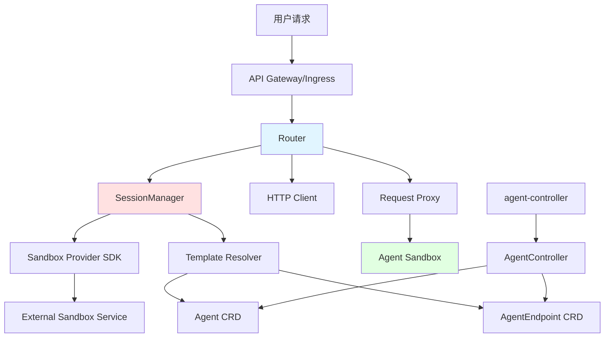

##### 4.2.5.2 Router 内部架构

参考 E2B client-proxy 设计，Router 内部采用分层架构：

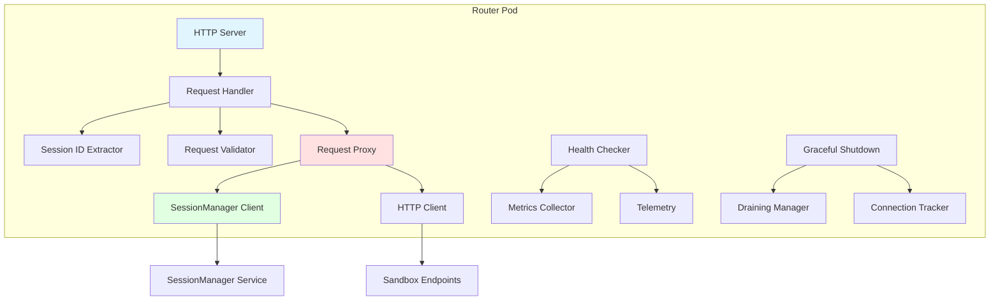

##### 4.2.5.3 核心组件设计

###### 4.2.5.3.1 Request Handler

请求处理器是 Router 的核心组件，参考 E2B 的设计模式，负责处理所有入站请求：

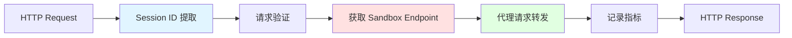

**核心职责**：

- **Session ID 提取**：从请求中提取会话标识符
- **请求验证**：验证请求格式和权限
- **Endpoint 获取**：通过 SessionManager 获取目标 sandbox 信息
- **请求代理**：将请求转发到对应的 sandbox
- **指标记录**：收集性能和监控数据

###### 4.2.5.3.2 SessionManager Client

与 SessionManager 的集成客户端，负责获取 sandbox 访问信息：

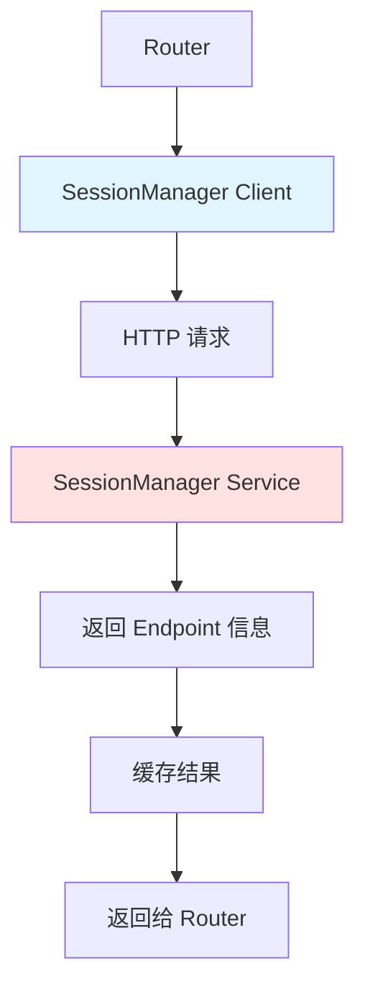

**主要功能**：

- **Endpoint 查询**：根据 session-id 获取 sandbox 访问信息
- **心跳更新**：维护会话活跃状态
- **状态查询**：获取会话和 sandbox 状态
- **连接管理**：维护与 SessionManager 的 HTTP 连接

###### 4.2.5.3.3 HTTP Client

标准 HTTP 客户端，用于请求转发：

**配置特点**：

- **连接复用**：支持连接池，提高性能
- **超时控制**：支持请求级别的超时设置
- **Keep-Alive**：启用长连接，减少连接开销
- **并发支持**：支持高并发请求处理

#### 4.2.6 详细设计

##### 4.2.6.1 请求处理流程

基于 agent-run 整体架构，Router 与 SessionManager 协作的完整流程：

```mermaid
sequenceDiagram
    participant Client
    participant Router
    participant SessionManager
    participant SandboxSDK
    participant TemplateResolver
    participant K8S as K8s API
    participant ExternalSandbox as External Sandbox Service
    participant Sandbox
    
    Client->>Router: HTTP Request (session-id: xxx)
    Router->>Router: Extract session-id & validate request
    Router->>SessionManager: GetSandboxEndpoint(session-id)
    
    alt Session exists & sandbox ready
        SessionManager-->>Router: Return sandbox endpoint
    else Session not exists or sandbox not ready
        SessionManager->>SessionManager: GetOrCreateSession(session-id, agent-type, user-id)
        SessionManager->>TemplateResolver: ResolveAgentTemplate(agent-type)
        TemplateResolver->>K8S: Get Agent CRD
        TemplateResolver->>K8S: Get AgentEndpoint CRD
        TemplateResolver-->>SessionManager: SandboxConfig
        
        SessionManager->>SandboxSDK: CreateSandbox(config)
        SandboxSDK->>ExternalSandbox: Create sandbox instance
        
        loop Wait for sandbox ready
            SandboxSDK->>ExternalSandbox: GetSandboxStatus()
            ExternalSandbox-->>SandboxSDK: Status update
        end
        
        ExternalSandbox-->>SandboxSDK: Sandbox ready
        SandboxSDK-->>SessionManager: Sandbox details & endpoint
        SessionManager->>SessionManager: Record session mapping
        SessionManager-->>Router: Sandbox endpoint
    end
    
    Router->>Router: Create HTTP client
    Router->>Sandbox: Forward request via HTTP client
    
    Note over Sandbox: Long-running processing (code execution, file ops, etc.)
    
    Sandbox-->>Router: Stream response
    Router-->>Client: Stream HTTP response
    
    Router->>SessionManager: UpdateSessionHeartbeat(session-id)
```

##### 4.2.6.2 与 SessionManager 的集成流程

Router 作为 frontend 组件的入口，与 SessionManager 的详细交互：

```mermaid
flowchart TD
    A[用户请求到达 Router] --> B[提取 session-id]
    B --> C[请求验证]
    C --> D[调用 SessionManager.GetSandboxEndpoint]
    
    D --> E{Session 是否存在?}
    E -->|存在| F[检查 Sandbox 状态]
    E -->|不存在| G[SessionManager 创建新会话]
    
    F --> H{Sandbox 是否就绪?}
    H -->|就绪| I[返回 Sandbox Endpoint]
    H -->|未就绪| J[等待 Sandbox 就绪]
    
    G --> K[解析 Agent CRD 模板]
    K --> L[调用 Sandbox Provider SDK]
    L --> M[创建外部 Sandbox 实例]
    M --> N[等待 Sandbox 启动]
    N --> O[记录 Session 映射]
    O --> I
    
    J --> P{超时?}
    P -->|是| Q[返回错误]
    P -->|否| R[继续等待]
    R --> H
    
    I --> S[创建 HTTP Client]
    S --> T[转发请求到 Sandbox]
    T --> U[处理响应]
    U --> V[更新 Session 心跳]
    V --> W[返回响应给用户]
    
    Q --> X[记录错误日志]
    X --> Y[返回 503 错误]
```

##### 4.2.6.3 Session ID 提取策略

Router 支持多种方式提取 session-id，确保灵活性和兼容性：

```mermaid
graph TD
    A[HTTP Request] --> B[Session ID 提取器]
    B --> C{提取方式}
    
    C -->|Header| D[X-Session-ID Header]
    C -->|Query| E[?session_id=xxx]
    C -->|Cookie| F[session_id Cookie]
    C -->|Path| G[/sessions/xxx/...]
    
    D --> H[Session ID]
    E --> H
    F --> H
    G --> H
    
    H --> I[请求验证]
    
    style B fill:#e1f5ff
    style H fill:#ffe1e1
```

**支持的提取方式**：

1. **Header 提取**：从 HTTP Header 中获取（默认：`X-Session-ID`）
2. **Query 参数提取**：从 URL 查询参数获取（默认：`session_id`）
3. **Cookie 提取**：从 Cookie 中获取（默认：`session_id`）
4. **Path 提取**：从 URL 路径中提取（如：`/sessions/{session_id}/...`）
5. **组合提取**：按优先级尝试多种方式

**配置示例**：

- **优先级顺序**：Header → Query → Cookie → Path
- **灵活配置**：支持自定义字段名和提取模式
- **向后兼容**：支持多种客户端集成方式

##### 4.2.6.4 Endpoint 查询与缓存

###### 4.2.6.4.1 缓存架构设计

Router 采用多层缓存策略来优化 Sandbox Endpoint 的查询性能：

```mermaid
graph TD
    A[Router 请求] --> B[Endpoint Resolver]
    B --> C{本地缓存}
    C -->|命中| D[返回 Endpoint]
    C -->|未命中| E[Redis 缓存]
    E -->|命中| F[更新本地缓存]
    F --> D
    E -->|未命中| G[SessionManager 查询]
    G --> H[创建/等待 Sandbox]
    H --> I[更新所有缓存层]
    I --> D
    
    style B fill:#e1f5ff
    style E fill:#ffe1e1
    style G fill:#e1ffe1
```

###### 4.2.6.4.2 Endpoint 信息结构

**核心字段**：

- **SessionID**：会话唯一标识符
- **PodName**：Kubernetes Pod 名称
- **PodIP**：Pod 内部 IP 地址
- **Port**：服务端口号
- **Status**：状态（creating/ready/terminating）
- **时间戳**：创建和更新时间
- **TTL**：缓存生存时间

**Redis 存储策略**：

- **Key 格式**：`sandbox:session:{session_id}`
- **Value 格式**：JSON 序列化的 Endpoint 信息
- **TTL 设置**：根据 sandbox 超时时间动态调整

###### 4.2.6.4.3 查询流程设计

```mermaid
flowchart TD
    A[开始查询] --> B[检查本地缓存]
    B --> C{缓存命中且状态为 ready?}
    C -->|是| D[返回 Endpoint]
    C -->|否| E[查询 Redis 缓存]
    
    E --> F{Redis 命中?}
    F -->|是| G[检查状态]
    F -->|否| H[请求 SessionManager 创建]
    
    G --> I{状态为 ready?}
    I -->|是| J[更新本地缓存并返回]
    I -->|否| K[等待 Sandbox 就绪]
    
    H --> L[触发 Sandbox 创建流程]
    L --> K
    
    K --> M[轮询检查状态]
    M --> N{超时?}
    N -->|是| O[返回超时错误]
    N -->|否| P{状态变为 ready?}
    P -->|是| Q[更新缓存并返回]
    P -->|否| M
    
    style A fill:#e1f5ff
    style D fill:#e1ffe1
    style Q fill:#e1ffe1
    style O fill:#ffcccc
```

**关键特性**：

- **多级缓存**：本地内存 → Redis → SessionManager
- **状态感知**：只有 ready 状态的 Endpoint 才被认为可用
- **超时保护**：避免无限等待，设置合理的超时时间
- **轮询机制**：定期检查 Sandbox 状态变化
- **错误处理**：优雅处理各种异常情况

##### 4.2.6.5 请求转发设计

###### 4.2.6.5.1 代理架构

Router 采用高性能的 HTTP 代理模式，实现请求的透明转发：

```mermaid
graph LR
    A[客户端请求] --> B[Router 接收]
    B --> C[Session ID 提取]
    C --> D[Endpoint 解析]
    D --> E[构建目标 URL]
    E --> F[创建代理请求]
    F --> G[添加追踪信息]
    G --> H[发送到 Sandbox]
    H --> I[接收响应]
    I --> J[转发给客户端]
    
    style B fill:#e1f5ff
    style D fill:#ffe1e1
    style H fill:#e1ffe1
```

**核心处理步骤**：

1. **Session ID 提取**：从请求中识别会话标识
2. **Endpoint 解析**：获取目标 Sandbox 的访问信息
3. **URL 构建**：基于 Pod IP 和端口构建目标地址
4. **请求复制**：保持原始请求的所有信息
5. **Header 增强**：添加追踪和转发信息
6. **透明代理**：将请求无缝转发到 Sandbox
7. **响应回传**：将 Sandbox 响应原样返回给客户端

###### 4.2.6.5.2 超时策略

Router 支持多层次的超时控制，确保系统的稳定性：

```mermaid
graph TD
    A[请求到达] --> B[Endpoint 获取超时]
    B --> C{5分钟内获取到?}
    C -->|是| D[请求转发超时]
    C -->|否| E[返回 503 错误]
    
    D --> F{设置了转发超时?}
    F -->|是| G[在超时时间内完成]
    F -->|否| H[支持长时间运行]
    
    G --> I[正常响应]
    H --> I
    E --> J[记录错误日志]
    
    style B fill:#e1f5ff
    style D fill:#ffe1e1
    style I fill:#e1ffe1
    style E fill:#ffcccc
```

**超时配置层次**：

- **Endpoint 获取超时**：默认 5 分钟，包括 Sandbox 创建时间
- **请求转发超时**：默认无限制，支持长时间运行的任务
- **空闲连接超时**：默认 90 秒，优化连接池管理
- **Keep-Alive 间隔**：默认 30 秒，保持连接活跃

###### 4.2.6.5.3 长连接与流式响应

Router 特别优化了对长时间运行任务的支持：

```mermaid
graph TD
    A[长时间请求] --> B[检查 Flusher 支持]
    B --> C[启用流式传输]
    C --> D[32KB 缓冲区]
    D --> E[实时数据传输]
    E --> F[定期 Flush]
    F --> G{数据传输完成?}
    G -->|否| E
    G -->|是| H[关闭连接]
    
    style C fill:#e1f5ff
    style E fill:#ffe1e1
    style H fill:#e1ffe1
```

**流式响应特性**：

- **实时传输**：支持代码执行、文件操作等长时间任务的实时输出
- **缓冲优化**：使用 32KB 缓冲区平衡性能和实时性
- **连接保持**：通过 Keep-Alive 机制维持长连接
- **错误处理**：优雅处理连接中断和超时情况

##### 4.2.6.6 健康检查与优雅关闭

###### 4.2.6.6.1 健康检查架构

Router 实现了多层次的健康检查机制，确保系统的可靠性和可观测性：

```mermaid
graph TD
    A[健康检查请求] --> B[HealthChecker]
    B --> C[Redis 连接检查]
    B --> D[K8s API 连接检查]
    B --> E[SessionManager 连接检查]
    
    C --> F{Redis 可用?}
    D --> G{K8s API 可用?}
    E --> H{SessionManager 可用?}
    
    F -->|是| I[检查通过]
    F -->|否| J[健康检查失败]
    G -->|是| I
    G -->|否| J
    H -->|是| I
    H -->|否| J
    
    I --> K[返回 200 OK]
    J --> L[返回 503 Service Unavailable]
    
    style B fill:#e1f5ff
    style I fill:#e1ffe1
    style J fill:#ffcccc
```

**健康检查组件**：

- **HealthChecker 结构**：包含 EndpointResolver 和 Redis 客户端
- **检查项目**：Redis 连接状态、K8s API 可用性、SessionManager 连通性
- **超时控制**：每次健康检查限制在 5 秒内完成
- **响应格式**：标准 JSON 格式，包含状态和错误信息

**检查流程**：

1. **Redis 连接检查**：通过 Ping 命令验证 Redis 连接状态
2. **K8s API 检查**：验证与 Kubernetes API Server 的连接
3. **SessionManager 检查**：确认与 SessionManager 服务的通信正常
4. **状态聚合**：所有检查项都通过才认为服务健康

###### 4.2.6.6.2 优雅关闭流程

参考 E2B 的优雅关闭设计，Router 实现了分阶段的关闭流程：

```mermaid
graph TD
    A[接收关闭信号] --> B[标记为 Draining 状态]
    B --> C[等待负载均衡器感知]
    C --> D[标记为 Unhealthy]
    D --> E[停止接收新请求]
    E --> F[等待现有请求完成]
    F --> G{超时检查}
    G -->|未超时| H[继续等待]
    G -->|已超时| I[强制关闭]
    H --> J{所有请求完成?}
    J -->|否| F
    J -->|是| K[清理资源]
    I --> K
    K --> L[关闭完成]
    
    style A fill:#e1f5ff
    style D fill:#ffe1e1
    style K fill:#e1ffe1
    style L fill:#90EE90
```

**关闭阶段说明**：

1. **Draining 阶段**：
   - 标记服务为排空状态
   - 等待负载均衡器停止转发新请求
   - 默认等待时间：30 秒

2. **Unhealthy 阶段**：
   - 健康检查返回失败状态
   - 确保不再接收新的流量
   - 开始处理现有请求的完成

3. **等待完成阶段**：
   - 监控活跃连接数量
   - 等待所有进行中的请求完成
   - 设置最大等待时间防止无限等待

4. **资源清理阶段**：
   - 关闭 HTTP 服务器
   - 清理连接池
   - 释放相关资源

**配置参数**：

- **drainingWait**：排空等待时间（默认 30 秒）
- **shutdownWait**：关闭等待时间（默认 60 秒）
- **连接跟踪**：实时监控活跃连接数量
- **优雅降级**：超时后强制关闭，避免无限等待

##### 4.2.6.7 可观测性

###### 4.2.6.7.1 监控指标体系

Router 实现了全面的监控指标体系，支持 Prometheus 格式的指标收集：

```mermaid
graph TD
    A[Router 监控体系] --> B[性能指标]
    A --> C[业务指标]
    A --> D[系统指标]
    
    B --> E[请求延迟分布]
    B --> F[吞吐量统计]
    B --> G[错误率监控]
    
    C --> H[Session 解析成功率]
    C --> I[Endpoint 查询延迟]
    C --> J[缓存命中率]
    
    D --> K[活跃连接数]
    D --> L[连接池使用率]
    D --> M[内存使用情况]
    
    style A fill:#e1f5ff
    style B fill:#ffe1e1
    style C fill:#e1ffe1
    style D fill:#fff2e1
```

**核心监控指标**：

1. **请求相关指标**：
   - `router_requests_total`：请求总数（按方法和状态码分类）
   - `router_request_duration_seconds`：请求处理延迟分布
   - `router_request_errors_total`：错误请求统计

2. **Endpoint 解析指标**：
   - `router_endpoint_resolve_duration_seconds`：Endpoint 查询延迟
   - `router_endpoint_cache_hits_total`：缓存命中次数
   - `router_endpoint_cache_misses_total`：缓存未命中次数

3. **连接管理指标**：
   - `router_active_connections`：当前活跃连接数
   - `router_connection_pool_size`：连接池大小
   - `router_connection_pool_usage`：连接池使用率

4. **系统资源指标**：
   - `router_memory_usage_bytes`：内存使用量
   - `router_goroutines_count`：协程数量
   - `router_gc_duration_seconds`：垃圾回收耗时

###### 4.2.6.7.2 分布式追踪架构

Router 集成了 OpenTelemetry 分布式追踪，提供端到端的请求链路追踪：

```mermaid
graph LR
    A[客户端请求] --> B[Router Span]
    B --> C[Session 提取 Span]
    B --> D[Endpoint 解析 Span]
    B --> E[请求转发 Span]
    
    D --> F[缓存查询 Span]
    D --> G[SessionManager 调用 Span]
    
    E --> H[HTTP 客户端 Span]
    E --> I[Sandbox 处理 Span]
    
    style B fill:#e1f5ff
    style D fill:#ffe1e1
    style E fill:#e1ffe1
```

**追踪层次结构**：

1. **根 Span**：`proxy_request`
   - 包含完整的请求处理生命周期
   - 记录 session-id、请求方法、路径等基础信息

2. **子 Span**：
   - `extract_session_id`：Session ID 提取过程
   - `get_endpoint`：Endpoint 获取过程
   - `forward_request`：请求转发过程

3. **属性标记**：
   - `session.id`：会话标识符
   - `sandbox.pod_name`：目标 Pod 名称
   - `sandbox.pod_ip`：目标 Pod IP
   - `http.method`：HTTP 方法
   - `http.status_code`：响应状态码

###### 4.2.6.7.3 结构化日志设计

Router 采用结构化日志记录，支持高效的日志查询和分析：

```mermaid
graph TD
    A[请求到达] --> B[创建日志上下文]
    B --> C[添加基础字段]
    C --> D[Session ID 提取]
    D --> E[添加会话信息]
    E --> F[Endpoint 解析]
    F --> G[添加目标信息]
    G --> H[请求处理]
    H --> I[记录完成日志]
    
    style B fill:#e1f5ff
    style E fill:#ffe1e1
    style G fill:#e1ffe1
    style I fill:#90EE90
```

**日志字段设计**：

1. **基础字段**：
   - `timestamp`：时间戳
   - `level`：日志级别
   - `method`：HTTP 方法
   - `path`：请求路径
   - `remote_addr`：客户端地址

2. **会话字段**：
   - `session_id`：会话标识符
   - `user_id`：用户标识符（如果可用）
   - `agent_type`：Agent 类型

3. **目标字段**：
   - `pod_name`：目标 Pod 名称
   - `pod_ip`：目标 Pod IP
   - `sandbox_id`：Sandbox 标识符

4. **性能字段**：
   - `duration`：处理耗时
   - `status`：响应状态码
   - `bytes_sent`：发送字节数
   - `bytes_received`：接收字节数

**日志级别策略**：

- **INFO**：正常请求完成、系统状态变更
- **WARN**：Session ID 提取失败、缓存未命中
- **ERROR**：Endpoint 获取失败、请求转发错误
- **DEBUG**：详细的处理步骤、性能调试信息

###### 4.2.6.7.4 告警规则设计

基于监控指标和日志，Router 定义了关键的告警规则：

**性能告警**：

- 请求延迟 P99 超过 5 秒
- 错误率超过 5%
- Endpoint 解析延迟超过 30 秒

**资源告警**：

- 活跃连接数超过阈值
- 内存使用率超过 80%
- 连接池使用率超过 90%

**业务告警**：

- Session ID 提取失败率超过 1%
- 缓存命中率低于 80%
- SessionManager 调用失败率超过 2%
