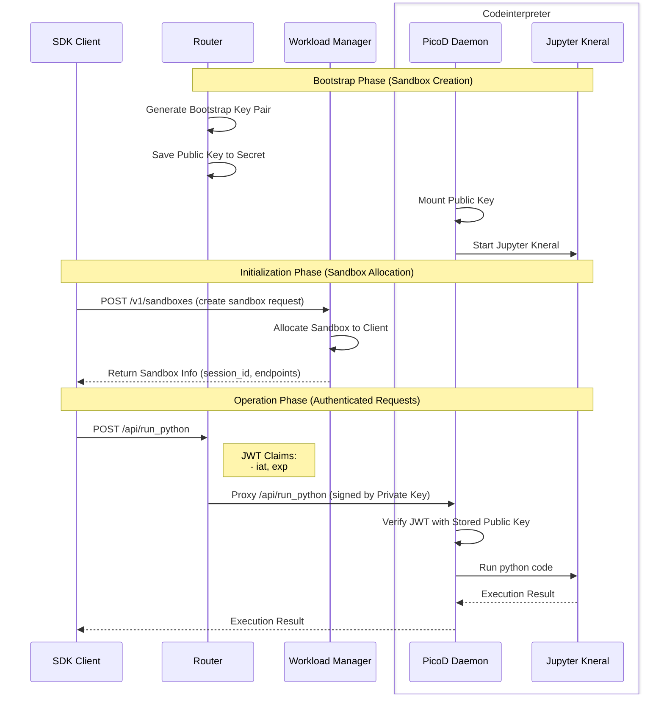

# Lite Picod Proposal

## Workflow

## Codeinterpreter Modification

1. **Mount public key instead of injection**
   1. Add options `disable_init`
   2. Verify operation request with mounted public key
2. **Run python code with Jupyter Kernal**
   1. Picod add a interface named /api/run_python
   2. Picod start a Jupyter Kernal at codeinterpreter start
   3. Run python code with jupyter kernal and reset kernel after each exectuation

## Need to confirm

1. **Where to sign JWT with private key**: router(ERS gateway) or SDK?
2. **What in JWT claims**: agent indentity?

