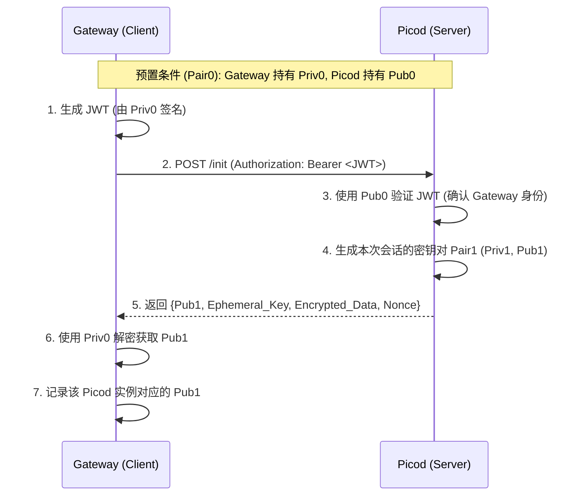

# Picod 请求加密设计文档

## 1. 概述
本文档详细介绍了为 `picod` 增加请求加密层的设计方案。其目标是在 Gateway（客户端）与 `picod`（服务器）之间建立一种类似简易版 TLS 的协商加密机制，确保数据在传输过程中的机密性。

## 2. 核心组件
- **Pair0 (静态密钥对)**: 预置密钥对。Gateway 持有私钥 (`Priv0`)，Picod 持有公钥 (`Pub0`)。用于 `/init` 认证和保护握手响应。
- **Pair1 (会话密钥对)**: Picod 在 `/init` 时生成的临时密钥对。Picod 持有私钥 (`Priv1`)，Gateway 获取并记录公钥 (`Pub1`)。
- **混合加密 (Hybrid Encryption)**: 每个业务请求使用一次性对称密钥，该密钥通过 `Eph_Key` 和 `Pair1` 实时计算派生。
- **元数据传输**: 使用自定义 HTTP Header 传输加解密所需的元数据（如临时公钥和 Nonce），确保协议的鲁棒性。

## 3. 密钥协商阶段 (`/init`)

### 3.1 协商流程

## 4. 业务请求阶段

### 4.1 混合加密流程 (每个请求)

为了同时保证机密性和完整性，Gateway 和 Picod 遵循以下顺序：

**Gateway (发送端):**
1. **派生密钥**: 生成临时 EC 密钥对 `Eph_Key`。计算 `Shared_Secret = ECDH(Eph_Priv, Pub1)`。
2. **派生 SK**: 使用 HKDF 从 `Shared_Secret` 派生出请求级对称密钥 `SK`。
3. **加密**: 使用 `SK` 加密明文请求体 `P`，得到密文 `C`。
4. **构建请求**: 
    - 设置 Header `X-Picod-Eph-Pub` 为 `Eph_Pub` 的 Base64。
    - 设置 Header `X-Picod-Nonce` 为 `Nonce` 的 Base64。
    - Body 设为纯二进制密文 `C`。
5. **哈希与签名**: 计算 `H = SHA256(Body)`，构建 JWT 并签名（含 `canonical_request_sha256: H`）。
6. **发送**: 发送 `POST` 请求，`Content-Type` 为 `application/octet-stream`。

**Picod (接收端):**
1. **验证签名与完整性**: `AuthMiddleware` 验证 JWT 签名及 Body 哈希。
2. **提取元数据**: 从 Header 中读取 `X-Picod-Eph-Pub` 和 `X-Picod-Nonce` 并解码。
3. **派生 SK**: 计算 `Shared_Secret = ECDH(Priv1, Eph_Pub)`。使用 HKDF 派生出相同的 `SK`。
4. **解密**: 使用 `SK` 和 `Nonce` 解密 Body 密文，还原明文 `P`。
5. **处理**: 将明文 `P` 写回 `c.Request.Body` 交付业务 Handler。

## 5. 安全与配置说明
- **环境变量控制**: 
    - `PICOD_ENCRYPTION_ENABLED`: 设置为 `true` 时强制开启请求加密。默认为 `false`。
- **前向安全性**: 每个请求都使用临时的 `Eph_Key` 派生 `SK`，单次泄露不影响全局。
- **模式限定**: 此加密层仅在 `static` 认证模式下生效。

## 6. 异常处理
- **未初始化错误**: 当开启加密但未完成 `/init` 协商时，业务接口返回 `403 Forbidden`，错误信息：`Encryption required but session key not initialized. Please call /init first.`
- **解密失败错误**: 
    - 缺少 Header (`X-Picod-Eph-Pub` 或 `X-Picod-Nonce`)。
    - AES-GCM 解密失败或 Tag 校验不通过。
    - 以上情况返回 `401 Unauthorized`，错误信息：`Decryption failed: <reason>`。

## 7. 实现细节

### 6.1 `AuthManager` 变更
- `sessionPriv1 *ecdsa.PrivateKey`: 存储本次会话的私钥。该密钥在 `/init` 时生成，仅存于内存中。
- `InitHandler`: 
    1. 验证 JWT。
    2. 生成 `Pair1`。
    3. 生成临时 `Tmp_Key`，计算 `S = ECDH(Tmp_Priv, Pub0)`。
    4. 使用 `S` 派生的密钥加密 `Pub1` 的 DER 编码。
    5. 返回加密数据及 `Tmp_Pub`。
- `AuthMiddleware`: 
    1. 校验 JWT。
    2. 从 Header 提取 `X-Picod-Eph-Pub` 和 `X-Picod-Nonce`。
    3. 派生 `SK`，解密 Body（AES-GCM 会自动校验末尾的 16字节 Tag）。

### 6.2 关键术语与规范
- **Tag (认证标签)**: AES-GCM 生成的 16 字节校验码，用于检测密文是否被篡改。在传输时，密文 Body = `[Actual Ciphertext] + [16-byte Tag]`。
- **Nonce (随机数)**: 每次加密由**发送方**生成的 12 字节随机数，通过 Header 传递，确保即使明文相同，密文也完全不同。
- **Ephemeral Public Key (临时公钥)**: 每次业务请求由 Gateway 随机生成，Picod 结合自身的 `Priv1` 通过 ECDH 算法派生出本次请求的对称密钥 `SK`。
- **编码**: 所有 Header 中的二进制字段均使用标准 Base64 编码。
