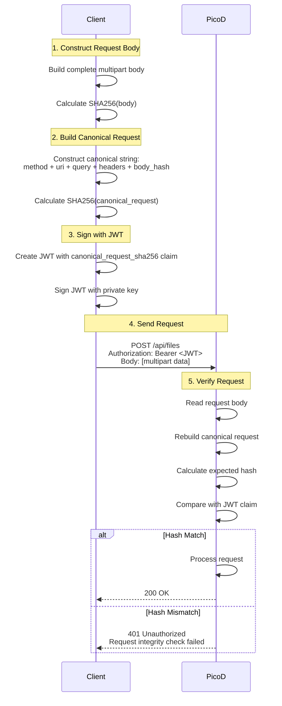

# PicoD Authentication and Multipart Request Construction

Author: VanderChen
Date: 2026-02-24

## Overview

This document explains PicoD's request signing mechanism and why multipart requests must be manually constructed instead of using standard HTTP client libraries. It provides detailed examples for developers implementing PicoD clients.

## Table of Contents

- [Authentication Architecture](#authentication-architecture)
- [Canonical Request Signing](#canonical-request-signing)
- [Why Manual Multipart Construction](#why-manual-multipart-construction)
- [Implementation Examples](#implementation-examples)
- [Server-Side Verification](#server-side-verification)
- [Best Practices](#best-practices)

## Authentication Architecture

PicoD uses JWT-based authentication with a **canonical request signing** mechanism similar to AWS Signature V4. This ensures request integrity and prevents tampering.

### Key Principles

1. **Sign Before Send**: Calculate the hash of the complete request body BEFORE sending
2. **Include Hash in JWT**: Embed the canonical request hash in JWT claims
3. **Server Verification**: Server recalculates the hash and compares with JWT claim

### Authentication Flow



## Canonical Request Signing

### Canonical Request Format

The canonical request is a standardized string representation of the HTTP request:

```
<HTTP_METHOD>\n
<URI>\n
<CANONICAL_QUERY_STRING>\n
<CANONICAL_HEADERS>\n
<SIGNED_HEADERS>\n
<BODY_SHA256>
```

### Example

For a multipart file upload request:

```http
POST /api/files HTTP/1.1
Content-Type: multipart/form-data; boundary=abc123
Authorization: Bearer <JWT>

--abc123
Content-Disposition: form-data; name="path"

/tmp/test.txt
--abc123
Content-Disposition: form-data; name="file"; filename="test.txt"
Content-Type: application/octet-stream

[file content: 31.5MB binary data]
--abc123--
```

The canonical request string would be:

```
POST
/api/files

content-type:multipart/form-data; boundary=abc123
content-type
d41d8cd98f00b204e9800998ecf8427e...
```

### Calculation Steps (Client-Side)

```python
# Step 1: Calculate body hash
body_hash = hashlib.sha256(body_bytes).hexdigest()

# Step 2: Build canonical request string
canonical_request = "\n".join([
    "POST",                                      # HTTP method
    "/api/files",                                # URI path
    "",                                          # Query string (empty if none)
    "content-type:multipart/form-data; boundary=abc123\n",  # Canonical headers
    "content-type",                              # Signed headers
    body_hash                                    # Body SHA256 hash
])

# Step 3: Calculate canonical request hash
canonical_hash = hashlib.sha256(canonical_request.encode()).hexdigest()

# Step 4: Include in JWT claims
token = jwt.encode({
    'canonical_request_sha256': canonical_hash,
    'iat': now,
    'exp': now + 300
}, private_key, algorithm='ES256')
```

### Server-Side Verification (auth.go:407-431)

```go
// Read complete request body
var bodyBytes []byte
if c.Request.Body != nil {
    bodyBytes, _ = io.ReadAll(c.Request.Body)
    c.Request.Body = io.NopCloser(bytes.NewBuffer(bodyBytes))
}

// Extract claimed hash from JWT
claimedHash := claims["canonical_request_sha256"].(string)

// Rebuild canonical request and calculate actual hash
actualHash := buildCanonicalRequestHash(c.Request, bodyBytes)

// Compare hashes
if claimedHash != actualHash {
    c.JSON(401, gin.H{
        "error": "Request integrity check failed",
        "detail": "canonical_request_sha256 mismatch"
    })
    return
}
```

## Why Manual Multipart Construction

### The Problem with Standard Libraries

When using standard HTTP clients like Python's `requests` library:

```python
# Standard way - CANNOT get actual body bytes
files = {'file': open('test.txt', 'rb')}
data = {'path': '/tmp/test.txt', 'mode': '644'}
response = requests.post(url, files=files, data=data)
```

**Problems:**
1. The library constructs multipart body **at send time**
2. No way to access the serialized body bytes beforehand
3. Cannot calculate accurate body SHA256 hash
4. Cannot include correct hash in JWT
5. **Server will reject the request** due to hash mismatch

### The Solution: Manual Construction

To satisfy the signing requirements, we must manually construct the multipart body:

```python
import uuid

# Generate boundary
boundary = uuid.uuid4().hex

# Manually construct multipart body
parts = []

# Field: path
parts.append(f'--{boundary}\r\n'.encode())
parts.append(b'Content-Disposition: form-data; name="path"\r\n\r\n')
parts.append(path.encode() + b'\r\n')

# Field: mode
parts.append(f'--{boundary}\r\n'.encode())
parts.append(b'Content-Disposition: form-data; name="mode"\r\n\r\n')
parts.append(mode.encode() + b'\r\n')

# Field: file (large binary content)
parts.append(f'--{boundary}\r\n'.encode())
parts.append(f'Content-Disposition: form-data; name="file"; filename="{filename}"\r\n'.encode())
parts.append(b'Content-Type: application/octet-stream\r\n\r\n')
parts.append(content)  # 31.5MB binary data
parts.append(b'\r\n')

# Closing boundary
parts.append(f'--{boundary}--\r\n'.encode())

# Assemble complete body (THIS IS THE KEY!)
body = b''.join(parts)
content_type = f'multipart/form-data; boundary={boundary}'
```

**Now we can:**
1. ✅ Get complete body bytes: `body`
2. ✅ Calculate body hash: `sha256(body)`
3. ✅ Build canonical request with accurate hash
4. ✅ Sign and include in JWT
5. ✅ Server verification will succeed

## Implementation Examples

### Example 1: Small File Upload (JSON Base64)

For files < 10MB, use JSON with base64 encoding:

```python
def upload_file_json(self, path: str, content: bytes, mode: str = "644"):
    """Upload file using JSON base64 encoding (for small files)"""

    # Encode content
    content_b64 = base64.b64encode(content).decode()

    # Build JSON body
    json_data = {
        'path': path,
        'content': content_b64,
        'mode': mode
    }
    body = json.dumps(json_data).encode()
    content_type = 'application/json'

    # Calculate canonical hash
    canonical_hash = self._build_canonical_request_hash(
        'POST', '/api/files', body, content_type
    )

    # Create JWT
    token = self._create_jwt(self.session_private_key, {
        'canonical_request_sha256': canonical_hash
    })

    # Send request
    headers = {
        'Authorization': f'Bearer {token}',
        'Content-Type': content_type
    }

    response = requests.post(
        f'{self.base_url}/api/files',
        headers=headers,
        data=body
    )
    return response.json()
```

### Example 2: Large File Upload (Multipart)

For files > 10MB, use multipart to avoid base64 overhead (33% size increase):

```python
def upload_file_multipart(self, path: str, content: bytes, mode: str = "644"):
    """Upload file using multipart/form-data (for large files)"""

    # Generate unique boundary
    import uuid
    boundary = uuid.uuid4().hex

    # Manually construct multipart body
    parts = []

    # Add 'path' field
    parts.append(f'--{boundary}\r\n'.encode())
    parts.append(b'Content-Disposition: form-data; name="path"\r\n\r\n')
    parts.append(path.encode() + b'\r\n')

    # Add 'mode' field
    parts.append(f'--{boundary}\r\n'.encode())
    parts.append(b'Content-Disposition: form-data; name="mode"\r\n\r\n')
    parts.append(mode.encode() + b'\r\n')

    # Add 'file' field with actual file content
    filename = os.path.basename(path)
    parts.append(f'--{boundary}\r\n'.encode())
    parts.append(f'Content-Disposition: form-data; name="file"; filename="{filename}"\r\n'.encode())
    parts.append(b'Content-Type: application/octet-stream\r\n\r\n')
    parts.append(content)  # Raw binary content (e.g., 31.5MB)
    parts.append(b'\r\n')

    # Add closing boundary
    parts.append(f'--{boundary}--\r\n'.encode())

    # Assemble complete body
    body = b''.join(parts)
    content_type = f'multipart/form-data; boundary={boundary}'

    # Calculate canonical hash with complete body
    canonical_hash = self._build_canonical_request_hash(
        'POST', '/api/files', body, content_type
    )

    # Create JWT with canonical hash
    token = self._create_jwt(self.session_private_key, {
        'canonical_request_sha256': canonical_hash
    })

    # Send request with pre-constructed body
    headers = {
        'Authorization': f'Bearer {token}',
        'Content-Type': content_type
    }

    response = requests.post(
        f'{self.base_url}/api/files',
        headers=headers,
        data=body,  # Use pre-constructed body
        timeout=60
    )

    return response.json()
```

### Example 3: Run Python File (Alternative Style)

The `run_python_file` method in test_picod.py shows an alternative construction style:

```python
def run_python_file(self, file_path: str, timeout: str = "5m"):
    """Execute Python file - alternative multipart construction"""

    with open(file_path, 'rb') as f:
        content = f.read()

    filename = os.path.basename(file_path)
    boundary = '----WebKitFormBoundary7MA4YWxkTrZu0gW'

    # Build parts list (different style but same result)
    body_parts = []

    # File field
    body_parts.append(f'--{boundary}'.encode())
    body_parts.append(f'Content-Disposition: form-data; name="file"; filename="{filename}"'.encode())
    body_parts.append(b'Content-Type: application/octet-stream')
    body_parts.append(b'')  # Empty line separates headers from body
    body_parts.append(content)

    # Timeout field
    body_parts.append(f'--{boundary}'.encode())
    body_parts.append(b'Content-Disposition: form-data; name="timeout"')
    body_parts.append(b'')
    body_parts.append(timeout.encode())

    # Closing
    body_parts.append(f'--{boundary}--'.encode())
    body_parts.append(b'')

    # Join with \r\n (achieves same result as explicit \r\n in parts)
    body = b'\r\n'.join(body_parts)
    content_type = f'multipart/form-data; boundary={boundary}'

    # Rest of signing and sending process...
    canonical_hash = self._build_canonical_request_hash(
        'POST', '/api/run_python_file', body, content_type
    )

    token = self._create_jwt(self.session_private_key, {
        'canonical_request_sha256': canonical_hash
    })

    headers = {
        'Authorization': f'Bearer {token}',
        'Content-Type': content_type
    }

    response = requests.post(
        f'{self.base_url}/api/run_python_file',
        headers=headers,
        data=body
    )

    return response.json()
```

### Comparison: Two Construction Styles

Both methods produce the same final multipart body:

| Aspect | upload_file_multipart | run_python_file |
|--------|----------------------|-----------------|
| Boundary style | `uuid.uuid4().hex` | Fixed string |
| Part construction | `\r\n` embedded in each part | Parts joined with `\r\n` |
| Readability | More explicit structure | More compact |
| Result | **Identical** | **Identical** |

Final body structure (both methods):

```
--{boundary}\r\n
Content-Disposition: form-data; name="path"\r\n
\r\n
/tmp/test.txt\r\n
--{boundary}\r\n
Content-Disposition: form-data; name="file"; filename="test.txt"\r\n
Content-Type: application/octet-stream\r\n
\r\n
[binary content]
\r\n
--{boundary}--\r\n
```

## Server-Side Verification

### Authentication Middleware (auth.go:344-504)

PicoD's authentication middleware performs the following checks:

```go
func (am *AuthManager) AuthMiddleware() gin.HandlerFunc {
    return func(c *gin.Context) {
        // 1. Check initialization
        if !am.IsInitialized() {
            c.JSON(403, gin.H{"error": "Server not initialized"})
            c.Abort()
            return
        }

        // 2. Extract and verify JWT
        token, err := jwt.Parse(tokenString, func(token *jwt.Token) (interface{}, error) {
            return am.publicKey, nil  // Use stored session public key
        })

        // 3. Read complete request body
        var bodyBytes []byte
        if c.Request.Body != nil {
            bodyBytes, _ = io.ReadAll(c.Request.Body)
            c.Request.Body = io.NopCloser(bytes.NewBuffer(bodyBytes))
        }

        // 4. Verify canonical request hash
        claims := token.Claims.(jwt.MapClaims)
        claimedHash := claims["canonical_request_sha256"].(string)

        actualHash := buildCanonicalRequestHash(c.Request, bodyBytes)

        if claimedHash != actualHash {
            // Detailed debug logging (truncated for brevity)
            klog.Warningf(`[AUTH DEBUG] canonical_request_sha256 MISMATCH
                CLAIMED: %s
                ACTUAL:  %s
                METHOD:  %s
                URI:     %s
                BODY_HASH: %s
            `, claimedHash, actualHash, c.Request.Method, c.Request.URL.Path,
               fmt.Sprintf("%x", sha256.Sum256(bodyBytes)))

            c.JSON(401, gin.H{
                "error": "Request integrity check failed",
                "detail": "canonical_request_sha256 mismatch"
            })
            c.Abort()
            return
        }

        // 5. Enforce body size limit (32MB)
        c.Request.Body = http.MaxBytesReader(c.Writer, c.Request.Body, MaxBodySize)

        c.Next()
    }
}
```

### Canonical Request Builder (auth.go:506-540)

```go
func buildCanonicalRequestHash(r *http.Request, body []byte) string {
    // 1. HTTP Method (uppercase)
    method := strings.ToUpper(r.Method)

    // 2. URI path
    uri := r.URL.Path
    if uri == "" {
        uri = "/"
    }

    // 3. Canonical query string (sorted parameters)
    queryString := buildCanonicalQueryString(r)

    // 4. Canonical headers (only Content-Type)
    canonicalHeaders, signedHeaders := buildCanonicalHeaders(r)

    // 5. Body hash
    bodyHash := fmt.Sprintf("%x", sha256.Sum256(body))

    // 6. Build canonical request
    canonicalRequest := strings.Join([]string{
        method,
        uri,
        queryString,
        canonicalHeaders,
        signedHeaders,
        bodyHash,
    }, "\n")

    // 7. Return SHA256 of canonical request
    hash := sha256.Sum256([]byte(canonicalRequest))
    return fmt.Sprintf("%x", hash)
}
```

### File Upload Handler (files.go:44-147)

After authentication passes, the handler processes the multipart body:

```go
func (s *Server) UploadFileHandler(c *gin.Context) {
    contentType := c.ContentType()

    if strings.HasPrefix(contentType, "multipart/form-data") {
        s.handleMultipartUpload(c)
    } else {
        s.handleJSONBase64Upload(c)
    }
}

func (s *Server) handleMultipartUpload(c *gin.Context) {
    // Extract form fields (Gin parses the multipart body)
    path := c.PostForm("path")
    fileHeader, _ := c.FormFile("file")
    modeStr := c.PostForm("mode")

    // Validate and save file
    safePath, _ := s.sanitizePath(path)
    fileMode := parseFileMode(modeStr)

    src, _ := fileHeader.Open()
    dst, _ := os.OpenFile(safePath, os.O_WRONLY|os.O_CREATE|os.O_TRUNC, fileMode)
    io.Copy(dst, src)

    // Return file info
    c.JSON(200, FileInfo{...})
}
```

## Best Practices

### 1. Choose the Right Upload Method

| File Size | Method | Reason |
|-----------|--------|--------|
| < 10MB | JSON Base64 | Simple, no boundary management |
| > 10MB | Multipart | Avoids 33% size overhead from base64 |
| > 32MB | Not supported | Server limit: 32MB max body size |

### 2. Body Size Considerations

```python
# For 31.5MB file
file_size = 31.5 * 1024 * 1024

# Base64 overhead: 33%
base64_size = file_size * 1.33  # = 41.9MB (exceeds 32MB limit!)

# Multipart overhead: < 1KB
multipart_size = file_size + 1024  # = 31.5MB (within limit)
```

### 3. Boundary Generation

```python
# Option 1: UUID (recommended for uniqueness)
import uuid
boundary = uuid.uuid4().hex

# Option 2: Fixed string (simpler but less unique)
boundary = '----WebKitFormBoundary7MA4YWxkTrZu0gW'
```

### 4. Error Handling

```python
try:
    response = self.upload_file_multipart(path, content)
except requests.exceptions.RequestException as e:
    if e.response.status_code == 401:
        print("Authentication failed - check JWT signing")
    elif e.response.status_code == 413:
        print("File too large - exceeds 32MB limit")
    else:
        print(f"Upload failed: {e}")
```

### 5. Testing Canonical Hash Calculation

```python
# Debug helper: print canonical request components
def debug_canonical_request(method, url, body, content_type):
    body_hash = hashlib.sha256(body).hexdigest()

    canonical_request = "\n".join([
        method,
        url,
        "",  # query string
        f"content-type:{content_type}\n",
        "content-type",
        body_hash
    ])

    print("=== Canonical Request Components ===")
    print(f"Method: {method}")
    print(f"URL: {url}")
    print(f"Content-Type: {content_type}")
    print(f"Body Hash: {body_hash}")
    print(f"Canonical Hash: {hashlib.sha256(canonical_request.encode()).hexdigest()}")
```

### 6. Security Best Practices

1. **Private Key Protection**: Never log or expose private keys
2. **JWT Expiration**: Keep token lifetime short (5 minutes recommended)
3. **HTTPS Only**: Always use HTTPS in production
4. **Body Size Limits**: Respect 32MB limit to prevent memory exhaustion
5. **Path Validation**: Server enforces workspace isolation via `sanitizePath()`

## Troubleshooting

### Common Issues

#### 1. Hash Mismatch Error

```
401 Unauthorized: canonical_request_sha256 mismatch
```

**Causes:**
- Body bytes don't match what server receives
- Content-Type header mismatch
- Query parameters not sorted correctly
- Extra whitespace in multipart body

**Solution:**
```python
# Log both client and server hashes
print(f"Client calculated hash: {canonical_hash}")
# Check server logs for actual hash
```

#### 2. Body Too Large

```
413 Request Entity Too Large
```

**Solution:**
```python
# Check file size before upload
if len(content) > 31.5 * 1024 * 1024:
    print("File too large, consider compression")
```

#### 3. Multipart Parse Error

```
400 Bad Request: Failed to get file
```

**Causes:**
- Missing `\r\n` separators
- Incorrect boundary format
- Missing or malformed Content-Disposition headers

**Solution:**
```python
# Validate multipart structure
print(body[:500])  # Print first 500 bytes to inspect format
```

## References

- RFC 2046: Multipart Media Type
- RFC 7519: JSON Web Token (JWT)
- AWS Signature Version 4 Signing Process
- PicoD Design Document: `docs/design/picod-proposal.md`
- Source Code:
  - Client: `test_picod.py`
  - Server: `pkg/picod/auth.go`, `pkg/picod/files.go`

## Conclusion

PicoD's request signing mechanism ensures request integrity and prevents tampering. While this requires manual multipart construction instead of using standard HTTP client features, the benefits are:

1. **Strong Security**: Request tampering is cryptographically prevented
2. **Verifiable Integrity**: Server can prove request hasn't been modified
3. **Stateless Authentication**: No session storage required
4. **Large File Support**: Efficient binary transfer without base64 overhead

By following the patterns and examples in this document, developers can correctly implement PicoD clients that satisfy the authentication requirements while maintaining code clarity and reliability.
